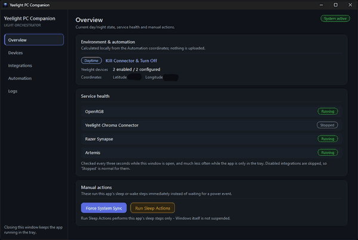
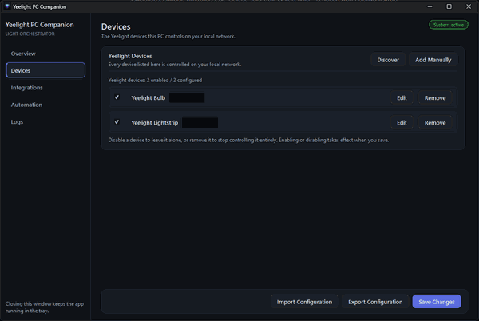
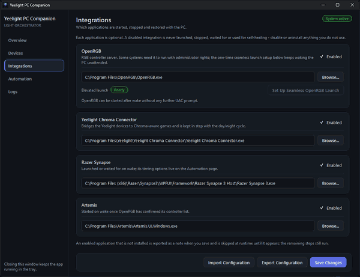
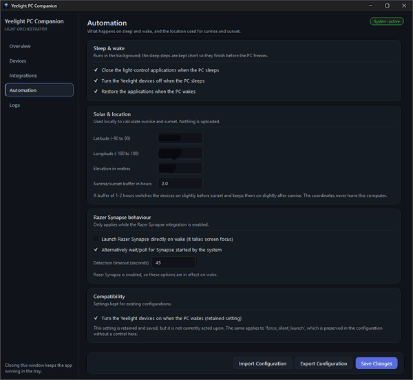

# Yeelight PC Companion

Yeelight PC Companion is a Windows tray application that keeps your Yeelight
room lighting and your local RGB software in step with the PC's sleep/wake cycle
and the local day/night cycle.

It began as a personal utility for one specific Windows/RGB setup and has been
progressively generalised. It is a local-only tool: it talks to your lights on
your own network and to OpenRGB/Artemis on `localhost`. It has no account, no
telemetry and no cloud component.

> **Release status.** **v1.0.1** is the current release (OpenRGB Windows-service
> conflict bugfix). **v1.0.0** was the first public release. The Windows
> installer and executables are **not code-signed**, so SmartScreen/reputation
> warnings may appear (see [Code signing](#code-signing)).

---

## Contents

- [What it does](#what-it-does)
- [Features](#features)
- [Screenshots](#screenshots)
- [Requirements](#requirements)
- [Installation](#installation)
- [First run](#first-run)
- [Yeelight LAN Control must be enabled](#yeelight-lan-control-must-be-enabled)
- [Integrations](#integrations)
- [Sleep and wake behaviour](#sleep-and-wake-behaviour)
- [Device discovery](#device-discovery)
- [Privacy and local-network statement](#privacy-and-local-network-statement)
- [Where your configuration lives](#where-your-configuration-lives)
- [Uninstalling](#uninstalling)
- [Troubleshooting](#troubleshooting)
- [Development and building](#development-and-building)
- [Releasing](#releasing)
- [Code signing](#code-signing)
- [Updates](#updates)
- [License](#license)

---

## What it does

When the PC goes to sleep, shuts down or you sign off, the app:

1. stops the Yeelight Chroma Connector first, so it releases music-mode control
   of your lights,
2. switches off every **enabled** configured Yeelight device over the LAN,
3. stops the configured RGB controller applications.

When the PC wakes (or the app starts), it:

1. restores the RGB software in a controlled order,
2. works out whether it is currently dark using local solar calculations from
   your coordinates,
3. at night, turns the enabled Yeelight devices on and starts the Yeelight
   Chroma Connector; during the day it keeps them off and makes sure the
   connector is not running.

While the PC is running it periodically re-checks the real state against the
expected state and corrects mismatches, so a crash, a missed transition or a
clock change heals itself.

## Features

- **Sleep/wake automation** for Yeelight devices and RGB controller software.
- **Day/night awareness** from your own coordinates, with a configurable
  sunrise/sunset buffer (computed locally with `ephem`; no network lookup).
- **Arbitrary Yeelight device list** — add as many LAN devices as you like, each
  with a friendly name, an address and its own enable switch. One unreachable
  device never blocks the others.
- **LAN device discovery**, or add a device by hand.
- **Integrations** for OpenRGB, Yeelight Chroma Connector, Razer Synapse 3 and
  Artemis 2, each independently enabled and pointed at its executable.
- **Seamless elevated OpenRGB launch** with a single one-time approval instead
  of a UAC prompt on every wake (see [Integrations](#integrations)).
- **OpenRGB Windows-service conflict detection and one-click repair.** OpenRGB
  1.0 can install a Windows service that fights YPC for OpenRGB's lifecycle.
  YPC detects it automatically and can stop+disable that one service after you
  approve (see [Troubleshooting](#troubleshooting)).
- **System tray** operation with a dashboard window: Overview, Devices,
  Integrations, Automation and Logs.
- **First-run wizard** — no JSON editing, no configuration file to create by
  hand.
- **Portable mode** — an opt-in marker file next to the executable switches all
  storage into the application folder.


## Screenshots

| Overview | Devices |
| --- | --- |
|  |  |
| **Integrations** | **Automation** |
|  |  |

## Requirements

- **Windows 10 or Windows 11 (64-bit).** This is a Windows-only application: it
  uses Win32 power notifications, the Windows tray and Task Scheduler. There is
  no macOS or Linux build.
- **Yeelight devices on the same LAN as the PC**, with **LAN Control enabled**
  in the Yeelight app (see below).
- Optional integrations require their own software to be installed separately:
  OpenRGB, Yeelight Chroma Connector, Razer Synapse 3, Artemis 2. None of them
  are bundled or modified by this project.

## Installation

### Installer (recommended)

1. Download `YeelightPCCompanion-<version>-setup.exe`.
2. Run it. It installs **per user**, into:

   ```text
   %LOCALAPPDATA%\Programs\Yeelight PC Companion
   ```

   A per-user install needs **no administrator rights** for an ordinary install,
   which matches how the application stores its configuration. If you prefer a
   machine-wide install you can choose that in the wizard, in which case Windows
   will ask for elevation once.
3. The wizard offers a Start Menu shortcut, an optional Desktop shortcut, and an
   optional "start automatically when I sign in" entry.

### Portable ZIP

`Yeelight-PC-Companion-<version>-portable.zip` contains the same application
with a `portable.flag` marker. **Extract it to a folder you can write to**, then
run `YeelightPCCompanion.exe`. In portable mode the configuration, logs and
backups are stored **inside that folder** instead of `%LOCALAPPDATA%`, so you can
carry it on a USB stick. Nothing is installed and nothing is registered at logon.

Do not put the portable build in `C:\Program Files` — a normal (non-portable)
build deliberately never writes there, and a portable build needs write access
to its own folder.

## First run

On first launch with no configuration, a setup wizard opens and walks through:

1. **Welcome**
2. **Location** — latitude, longitude, elevation (metres) and the sunrise/sunset
   buffer in hours. These stay on your machine and are used only for the local
   day/night calculation.
3. **Devices** — discover Yeelight devices on your LAN or add them by hand.
   Zero devices is allowed.
4. **Integrations** — optionally enable and locate OpenRGB, the Yeelight Chroma
   Connector, Razer Synapse 3 and Artemis 2.
5. **Automation** — the sleep/wake options and the Razer Synapse behaviour.
6. **Review and finish** — a summary of what you chose, then **Finish** saves the
   configuration and the app continues normally.

If OpenRGB is enabled, the wizard asks **once** for the administrator approval
described in [Integrations](#integrations). Declining is not fatal: your
configuration is saved either way, and you can set it up later from the
**Integrations** page.

To re-run setup, remove the configuration file and start the app again.

## Yeelight LAN Control must be enabled

This application talks to your Yeelight devices directly over your local
network. For that to work you must enable **LAN Control** for each device:

1. Open the official **Yeelight** app on your phone.
2. Select the device → **Settings** → **LAN Control** → enable it.

Without LAN Control the device ignores local commands and the app cannot switch
it. The device must also be on the same network as the PC (a guest or isolated
VLAN will not work).

## Integrations

Each integration can be enabled independently and needs the path to its
executable.

| Integration | Process | Notes |
| --- | --- | --- |
| **OpenRGB** | `OpenRGB.exe` | Started with `--gui --startminimized --server`. See the elevation note below. |
| **Yeelight Chroma Connector** | `Yeelight Chroma Connector.exe` | Stopped first during sleep because it holds music-mode control of the lights. |
| **Razer Synapse 3** | `Razer Synapse 3.exe` | Optional delayed start after wake. |
| **Artemis 2** | `Artemis.UI.Windows.exe` | Receives the day/night state through its local JSON module API. |

### OpenRGB and the one-time administrator approval

OpenRGB needs administrator rights on many systems (RAM RGB and other
kernel-driver devices). Launching it with a UAC prompt is not acceptable during
an automatic wake, because nobody is in front of the PC.

Instead, when you enable OpenRGB the app asks for your approval **once** and
creates a dedicated Windows scheduled task:

```text
YeelightPCCompanion-OpenRGB
```

- run level `HighestAvailable`, logon type `InteractiveToken` (your own context —
  no stored password),
- **no triggers**: it never runs on a schedule and never at logon. It only runs
  when the app asks it to, and starting an existing highest-privilege task raises
  no UAC prompt,
- the task is only created for an OpenRGB executable that your normal user account
  **provably cannot replace** (for example under `C:\Program Files`). A writable
  copy would turn the task into a standing privilege-escalation path, so the app
  refuses that and tells you why.

Nothing about UAC is disabled or bypassed, and the app never edits consent
policy or the registry to suppress prompts. This is the only place the
application requests elevation, and only as a direct result of you asking for the
OpenRGB integration.

The task is separate from the application itself. **Yeelight PC Companion runs as
an ordinary, unelevated user process.**

### OpenRGB Windows service conflict

OpenRGB 1.0 can also install a **Windows service** named `OpenRGB` (the "OpenRGB
SDK Server"). If that service is set to start automatically, Windows starts
OpenRGB at boot and that service owns OpenRGB's lifecycle — which conflicts with
Yeelight PC Companion managing OpenRGB itself across sleep/wake.

When the OpenRGB integration is enabled, the Integrations page shows a separate
**Windows service** row:

| Status | Meaning |
| --- | --- |
| **No conflict** | No such service, or it is stopped and Disabled. |
| **Installed, not conflicting** | Stopped and set to Manual; it will not start with Windows. |
| **Conflict detected** | Running now, or set to start automatically. **Disable conflicting service** is offered. |
| **Needs review** | The service points at a different executable than your configured OpenRGB path. YPC will not touch it. |
| **Unknown** | The service could not be inspected. Review it manually. |

**Disable conflicting service** (only enabled when the service really is the
OpenRGB you configured) explains what it will do, asks once for administrator
approval, stops the service, sets its startup type to Disabled, and verifies
both facts. It then offers to run the normal Force System Sync so OpenRGB is
relaunched through Yeelight PC Companion.

Nothing is changed automatically. Startup, sleep and wake never elevate and
never modify the service.

## Sleep and wake behaviour

- The suspend sequence is deliberately fast: Windows freezes processes shortly
  after a suspend notification, so the app stops the Chroma Connector, sends a
  single bounded "off" command to every enabled device, and stops the RGB
  controllers within a small time budget. It does **not** verify each device,
  because a fast best-effort command is more reliable than several verified
  attempts that get frozen halfway.
- The elevated OpenRGB instance is stopped through its own scheduled task. Task
  Scheduler will end a task's process tree on behalf of the task's owner, which
  is what lets an unelevated app stop an elevated OpenRGB.
- On wake, OpenRGB is started and the app waits until OpenRGB reports that its
  **controller detection is complete** before handing over to Artemis. Starting
  Artemis earlier is what caused missing controllers in the past.
- If the OpenRGB elevation task is missing or its target is unsafe, OpenRGB is
  **skipped** for that restore with a log warning; Yeelight, Razer and Artemis
  handling continue normally. The app never falls back to a UAC prompt during an
  automatic wake.
- The **Run Sleep Actions** button in the Overview page runs the sleep sequence
  without actually suspending Windows, which is useful for testing.

## Device discovery

Discovery is **user-triggered only** (the **Discover** button on the Devices
page or in the wizard). It is never part of suspend or wake, so it can never
delay a power transition.

It uses the standard Yeelight SSDP discovery on your LAN, is bounded by a timeout,
and reports what it found so you can pick which devices to add. Devices are
matched against your existing list so re-discovering does not create duplicates.
A discovered device that changes address can be re-adopted without losing its
configuration.

## Privacy and local-network statement

- **No telemetry, no analytics, no accounts, no cloud.** Nothing is sent to the
  project or to any third party.
- Your coordinates are used **locally only** to compute sunrise/sunset with
  `ephem`. They are not transmitted anywhere.
- Device addresses, names and integration paths stay in your local configuration
  file.
- The only network traffic is:
  - **LAN**: commands to your Yeelight devices on port `55443`, and SSDP
    discovery when you explicitly ask for it;
  - **localhost**: Artemis' JSON module API on `127.0.0.1:9696`, and the OpenRGB
    SDK server on `127.0.0.1:6742`.
- The release artifacts are scanned by an automated privacy check
  (`tools/release_privacy_scan.py`) that fails the build if a personal
  configuration file, a log, or a known private value is ever packaged.

## Where your configuration lives

| Build | Configuration, logs and backups |
| --- | --- |
| Installer (normal) | `%LOCALAPPDATA%\Yeelight PC Companion` |
| Portable ZIP | the folder containing `YeelightPCCompanion.exe` |
| Running from source | the repository folder |

The folder contains:

- `config.json` — your settings,
- `config.json.bak` — a backup taken before a migration or import,
- `yeelight_pc_companion_debug.log` — the rotating runtime log,
- `crash.log` — only if the app ever crashes,
- `openrgb_provisioning.log` — a small diagnostic log for the OpenRGB task setup.

`config.json` is written atomically (write to a temporary file, then replace), so
an interrupted save cannot corrupt it.

## Uninstalling

Uninstall through **Settings → Apps → Installed apps → Yeelight PC Companion**.

Uninstall removes:

- the installed application files,
- the Start Menu and (if created) Desktop shortcuts,
- the per-user start-at-logon entry,
- the `YeelightPCCompanion-OpenRGB` scheduled task this app owns.

Uninstall **does not** remove:

- your configuration — `%LOCALAPPDATA%\Yeelight PC Companion` is left in place so
  reinstalling keeps your devices and settings. Delete that folder yourself if you
  want a clean slate,
- OpenRGB, Artemis, the Yeelight Chroma Connector, Razer Synapse or any of their
  files or settings.

Removing the scheduled task is reported, not fatal: if it cannot be removed the
rest of the uninstall still completes.

## Troubleshooting

**A light does not respond.**
Check that LAN Control is enabled for that device in the official Yeelight app,
that the device is on the same network as the PC, and that the address configured
on the **Devices** page still matches the device. Use **Discover** to find it
again.

**Nothing happens on wake.**
Wake restoration only runs if **Restore applications on wake** is enabled on the
**Automation** page. Check the **Logs** page for the sequence.

**OpenRGB says "Needs setup", "Needs repair" or "Unsafe OpenRGB location".**
The Integrations page shows the exact state. "Needs setup" means the elevation
task does not exist yet — use the set-up button. "Unsafe location" means your
normal user account can modify the OpenRGB executable; move OpenRGB to a
protected location such as `C:\Program Files` and update the path. The app
refuses to create a privileged task for a replaceable executable by design.

**OpenRGB is not detected after wake.**
This is usually OpenRGB still detecting controllers. The app waits for OpenRGB's
own `DETECTION_COMPLETE` event before starting Artemis, so very slow detection
delays the restore rather than silently dropping controllers. The log names how
many controllers detection produced and how long it took.

**Some RGB stays rainbow after boot, or OpenRGB appears even though start-at-login
is off.**
OpenRGB 1.0 may have installed a Windows service named `OpenRGB` that starts it
at boot. That fights Yeelight PC Companion for OpenRGB's lifecycle. Open the
**Integrations** page: the **Windows service** row detects this automatically.
Use **Disable conflicting service** (after the confirmation and one UAC prompt)
to stop that service and set it to Disabled. You do not need to open
`services.msc`. If the row says **Needs review**, the service points at a
different executable than the OpenRGB path you configured — inspect it manually
before changing anything.

**RGB is wrong until I kill OpenRGB and press Force System Sync.**
That is the service conflict above: a service-owned OpenRGB is started before
hardware is ready and cannot be cleanly restarted by YPC. Disable the conflicting
service from Integrations, then Force System Sync.

**The log is not where I expect it.**
See [Where your configuration lives](#where-your-configuration-lives). A portable
build logs next to its executable, not in `%LOCALAPPDATA%`.

**Windows shows a SmartScreen warning when I run the installer.**
Expected until the project has a trusted code-signing certificate — see
[Code signing](#code-signing).

## Development and building

### Running from source

```powershell
git clone https://github.com/BobanAliBrz/Yeelight-PC-Companion
cd Yeelight-PC-Companion
python -m pip install -r requirements.txt
python yeelight_pc_companion.py
```

From a source checkout the configuration is stored in the repository folder. No
configuration file needs to be created by hand: the first-run wizard does it.

### Tests

```powershell
python -m unittest discover -s tests -t .
```

The suite is Windows-oriented but never touches real hardware: LAN discovery,
Task Scheduler, elevation, sockets and power events are all mocked or guarded, so
it is safe to run anywhere.

### Building the release artifacts

```powershell
python -m pip install -r requirements-build.txt
pwsh -File .\build_release.ps1
```

This runs, in order: version-metadata generation and verification, the unit test
suite, syntax/import checks, the PyInstaller build, the privacy scans, the
portable ZIP and the Inno Setup installer. It fails on the first problem and
never requires a personal `config.json`.

Building the installer additionally requires **Inno Setup 6**
(`winget install JRSoftware.InnoSetup`).

Artifacts are written to `release\`:

```text
release\YeelightPCCompanion-<version>-setup.exe
release\Yeelight-PC-Companion-<version>-portable.zip
```

For a quick development build without the release pipeline, use
`build_yeelight_pc_companion.bat`; it produces `dist\YeelightPCCompanion\`.

### Repository layout

| Path | Purpose |
| --- | --- |
| `yeelight_pc_companion.py` | Main application: power handling, orchestration, tray, window, logging, entry point. |
| `config_manager.py` | Configuration schema, defaults, migration, validation, atomic writes, storage locations, per-user startup registration. |
| `yeelight_devices.py` | Yeelight device model, identity and LAN discovery. |
| `yeelight_device_ui.py` | Device list, add/edit, discovery dialogs. |
| `windows_tasks.py` | Windows scheduled-task elevation broker for OpenRGB. |
| `openrgb_service.py` | OpenRGB Windows-service probe, identity check, conflict policy and the explicit stop+disable repair. |
| `first_run_wizard.py` | The first-run setup wizard. |
| `ui_theme.py`, `ui_components.py` | Presentation layer: palette, stylesheets and reusable widgets. |
| `app_metadata.py` | **Single source of truth** for the product name and version. |
| `installer/` | Inno Setup script for the Windows installer. |
| `tools/` | Version-metadata generators and the release privacy scanner. |
| `tests/` | `unittest` suite. |
| `build_release.ps1` | Deterministic release build pipeline. |
| `.github/workflows/` | CI and the tag-triggered release build. |

### Versioning

The version is defined **once**, in `app_metadata.py`:

```python
VERSION = (1, 0, 1)
```

Everything else is derived from it:

- `version_info.txt` (the Windows EXE metadata) is **generated** by
  `tools/write_version_info.py`,
- `installer/version.iss` (read by the Inno Setup script) is **generated** by
  `tools/write_installer_version.py`,
- artifact names use `app_metadata.APP_VERSION`.

The installer has **no hard-coded fallback version**: if the generated include is
missing, compilation fails rather than shipping a mislabelled installer. Both
generated files are checked in CI, so a stale version is caught immediately.

To bump the version, change `VERSION` and re-run the release build.

## Releasing

1. Bump `VERSION` in `app_metadata.py`.
2. Update `changelog.md` and `project_memory.md`.
3. Run `pwsh -File .\build_release.ps1` locally and verify the artifacts.
4. Commit, then push a tag such as `v1.0.0`.
5. The **Release build** workflow runs the same pipeline on a Windows runner and
   uploads the installer, the portable ZIP and `SHA256SUMS.txt` **to the workflow
   run**. It deliberately does **not** create a GitHub Release, so a mis-tagged
   build cannot become public by accident.
6. Publish a GitHub Release manually from the verified workflow artifacts.

## Code signing

The installer and the executable are **not code-signed**, because a trusted
Authenticode code-signing certificate is required and is not available to the
project yet. In practice this means:

- Windows SmartScreen and reputation prompts are **likely** on first download
  and first run,
- the warnings will become less frequent as the download gains reputation, but
  they will not disappear reliably without signing.

No attempt is made to bypass SmartScreen, and no self-signed certificate is used
as if it provided public trust. Signing support can be added later as an optional
build step; normal builds must never require signing credentials, and no
certificate or private key belongs in this repository.

## Updates

**There is no auto-updater.** The application performs no background update
check and makes no outbound network request.

The versioning, artifact naming and installer are designed so that a future
update mechanism is possible: a single version source, a stable installer
`AppId` (so newer installers upgrade in place rather than installing side by
side), per-user installation that needs no elevation, and `SHA256SUMS.txt` for
artifact verification. Any future updater would be opt-in and user-visible.

## License

Yeelight PC Companion is free software licensed under the
**GNU General Public License, version 3 only** (`GPL-3.0-only`). See
[`LICENSE`](LICENSE) for the full text.

This means you may use, study, modify and redistribute it, including
commercially, provided that derivative works are distributed under the same
licence and their source is made available.

### Third-party dependencies

All direct dependencies are licence-compatible with `GPL-3.0-only`:

| Dependency | Licence |
| --- | --- |
| [PyQt6](https://pypi.org/project/PyQt6/) | GPL-3.0-only (or a commercial Riverbank licence) |
| [yeelight](https://pypi.org/project/yeelight/) | BSD |
| [ephem / PyEphem](https://pypi.org/project/ephem/) | MIT |
| [requests](https://pypi.org/project/requests/) | Apache-2.0 |
| [PyInstaller](https://pypi.org/project/pyinstaller/) (build only) | GPL-2.0-or-later with a special exception permitting distribution of bundled non-free programs |

PyQt6 is the reason the project is GPL-3.0-only rather than a more permissive
licence: using PyQt6 under its open-source terms requires distributing the
combined work under the GPL.